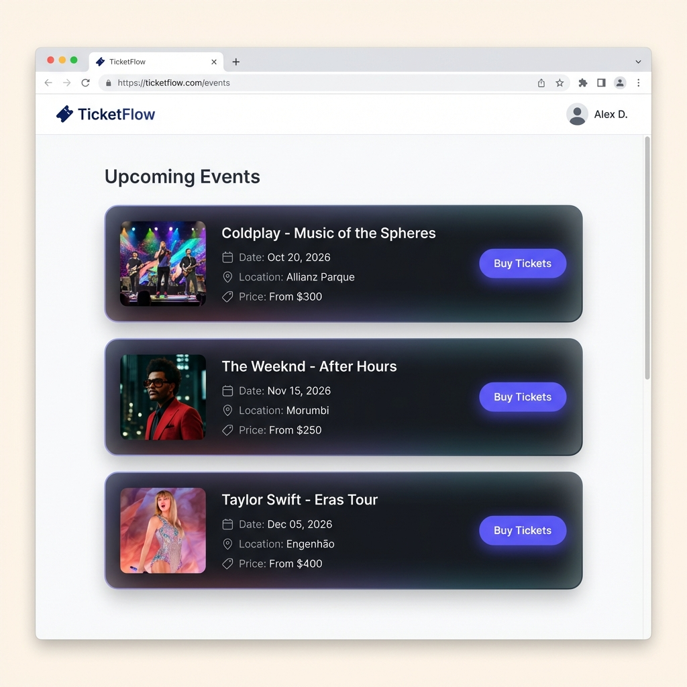
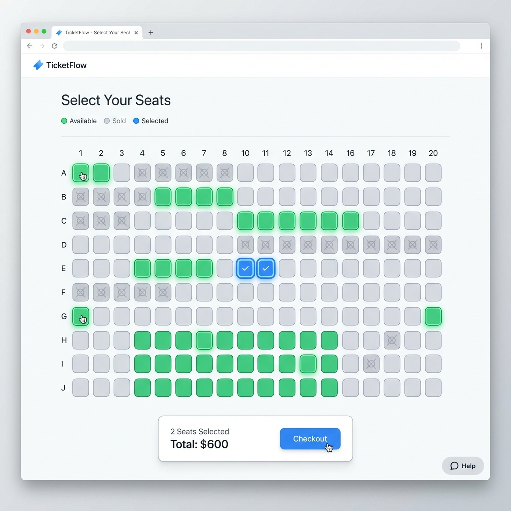

# TicketFlow

TicketFlow é um sistema de venda de ingressos de alta performance projetado para lidar com **concorrência extrema**. O foco principal deste projeto é demonstrar a implementação de estratégias robustas para garantir a integridade dos dados (como evitar vendas duplicadas do mesmo assento) em ambientes de alta demanda.

Este projeto foi desenvolvido como parte do meu portfólio para demonstrar habilidades em arquitetura de software, backend development com Ruby on Rails, e frontend development com React e TypeScript.

---

## 🚀 Tecnologias

O projeto utiliza uma stack moderna e performática:

### Backend
-   **Ruby on Rails 8+** (API Mode)
-   **PostgreSQL**: Banco de dados relacional robusto.
-   **Sidekiq + Redis**: Processamento de jobs em background.
-   **Pessimistic Locking**: Controle de concorrência a nível de banco de dados (`FOR UPDATE`) para garantir vendas atômicas.

### Frontend
-   **React 19**: Biblioteca UI moderna.
-   **TypeScript**: Tipagem estática para maior segurança e manutenibilidade.
-   **Vite**: Build tool extremamente rápida.
-   **Tailwind CSS v4**: Estilização utility-first moderna.
-   **TanStack Query**: Gerenciamento de estado do servidor e caching eficiente.
-   **Docker & Docker Compose**: O ambiente de desenvolvimento é totalmente containerizado para fácil replicação.

---

## 💡 Destaques Técnicos

### Gerenciamento de Concorrência (Pessimistic Locking)
O maior desafio em sistemas de venda de ingressos é garantir que dois usuários não comprem o mesmo assento simultaneamente.
No TicketFlow, isso é resolvido utilizando **Pessimistic Locking** no PostgreSQL.

O serviço `BuyTicketService` abre uma transação e bloqueia a linha do assento no banco de dados (`SELECT ... FOR UPDATE`) antes de verificar sua disponibilidade e processar a venda. Isso garante que, mesmo com milhares de requisições simultâneas, a integridade dos dados seja mantida e *overbooking* seja impossível.

```ruby
Seat.transaction do
  # O banco de dados bloqueia esse registro para outras transações até que esta termine
  seat = Seat.lock("FOR UPDATE").find(@seat_id)

  if seat.sold?
    raise SeatSoldError, "Seat already sold"
  end

  # ... processamento da venda
end
```

### Arquitetura Limpa e Escalável
-   **Service Objects**: A lógica de negócios complexa (como a compra de ingressos) é isolada em Service Objects (`BuyTicketService`), mantendo os Controllers magros e focados apenas em receber requisições e devolver respostas HTTP.
-   **Background Jobs**: Tarefas pesadas ou que não precisam bloquear o ciclo de resposta (como envio de emails de confirmação) são delegadas para o Sidekiq.
-   **Infraestrutura como Código**: Todo o ambiente (banco de dados, Redis, API, Frontend) sobe com um único comando via Docker Compose.

---

## 🛠️ Como Executar

### Pré-requisitos
-   Docker e Docker Compose instalados.

### Passo a Passo

1.  **Clone o repositório:**
    ```bash
    git clone https://github.com/matheusmoura0/ticket_flow.git
    cd ticket-flow
    ```

2.  **Inicie a aplicação:**
    Utilize o Docker Compose para subir todos os serviços (Frontend, Backend, Postgres, Redis).
    ```bash
    docker-compose up --build
    ```

3.  **Acesse a aplicação:**
    -   Frontend: [http://localhost:5173](http://localhost:5173)
    -   API Backend: [http://localhost:3000](http://localhost:3000)

---

## 📸 Screenshots

### Event List


### Seat Map


---

## 👨‍💻 Autor

**Matheus Oliveira**
Desenvolvedor Full Stack apaixonado por resolver problemas complexos e criar sistemas escaláveis.

[LinkedIn](https://www.linkedin.com/in/matheusmoura231/) | [GitHub](https://github.com/matheusmoura0)
